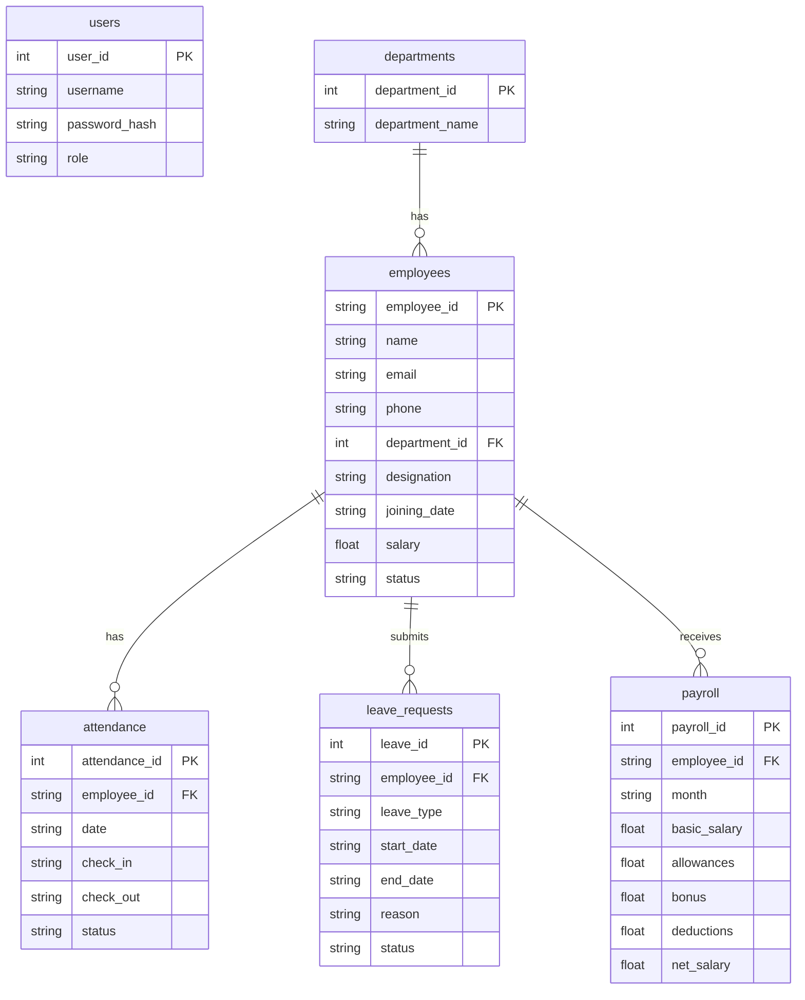

# EmployeeHub

A Terminal-Based Employee Management System built in Python and SQLite, applying Object-Oriented Programming principles.

## Features

- **Role-Based Access Control**: Admin, HR, and Employee roles with restricted permissions.
- **Employee Management**: Add, list, search, update, and delete employees.
- **Department Management**: Create departments and link them to employees.
- **Attendance**: Record daily attendance and calculate monthly attendance percentages.
- **Leave Management**: Submit, approve, and track leave requests.
- **Payroll**: Calculate gross and net salary, store monthly payrolls.
- **Dashboard**: Quick statistics on active employees, total departments, and pending leave requests.
- **Reporting**: Export payroll and employee data directly to CSV.

## Entity Relationship Diagram (ERD)



## Setup Instructions

1. Ensure you have **Python 3.x** installed.
2. Clone or download this project.
3. Install required dependencies from `requirements.txt`:
   ```bash
   pip install -r requirements.txt
   ```
4. Run the main application script:
   ```bash
   python main.py
   ```

## Project Structure

```text
EmployeeHub/
├── main.py                   # Main entry point and CLI menus
├── requirements.txt          # Python dependencies
├── README.md                 # Project documentation
├── database/                 # Database initialization and queries
│   ├── database.py
│   └── queries.py
├── models/                   # OOP Class models
│   ├── employee.py
│   ├── attendance.py
│   ├── leave.py
│   └── payroll.py
├── services/                 # Business logic and CRUD operations
│   ├── auth_service.py
│   ├── employee_service.py
│   ├── attendance_service.py
│   ├── leave_service.py
│   └── payroll_service.py
├── reports/                  # CSV Generation logic
│   └── report_generator.py
├── utils/                    # Shared helper and validation functions
│   ├── helpers.py
│   └── validators.py
└── data/                     # (Auto-generated) SQLite DB and CSV reports
    └── employeehub.db
```

## How to Operate

When you run `python main.py`, you will be greeted by the login screen. Upon running the app for the very first time, an `admin` user is automatically generated in the database.

**Default Admin Credentials:**

- **Username:** `admin`
- **Password:** `admin123`

### Step-by-Step Operation Guide:

1. **Login:** Use the default admin credentials to access the system.
2. **Create Departments:** Go to **Department Management (3)** and add a few departments (e.g., HR, IT, Finance).
3. **Add Employees:** Go to **Employee Management (2)** and add a new employee, assigning them to one of the newly created departments.
4. **Manage Users:** Go to **User Management (8)** to create new user accounts (e.g., a specific account for HR or an Employee). Note that an `Employee` role will have restricted menu options compared to an `Admin` or `HR`.
5. **Mark Attendance:** Go to **Attendance (4)** to log daily check-ins and check-outs.
6. **Generate Payroll:** Go to **Payroll (6)** at the end of the month to compute and save the net salaries.
7. **Export Data:** Go to **Reports & Analytics (7)** to export your employee list or the generated payroll as CSV files (they will appear in the `data/` folder).

### Screenshots

_In a terminal application, the UI consists of clear ASCII tables and menus._

```text
============================================================
                   EMPLOYEEHUB HR SYSTEM
============================================================
1. Dashboard
2. Employee Management
3. Department Management
4. Attendance
5. Leave Management
6. Payroll
7. Reports & Analytics
8. User Management
9. Logout
0. Exit
------------------------------------------------------------
Enter choice:
```

## License and Credits

This project was built by **Ashmam Apon** (the Antigravity AI User) as part of a Python Lab Project to demonstrate Object-Oriented Programming, SQLite Database Design, and modular application structure.

**MIT License**

Copyright (c) 2026

Permission is hereby granted, free of charge, to any person obtaining a copy of this software and associated documentation files (the "Software"), to deal in the Software without restriction, including without limitation the rights to use, copy, modify, merge, publish, distribute, sublicense, and/or sell copies of the Software, and to permit persons to whom the Software is furnished to do so, subject to the following conditions:

The above copyright notice and this permission notice shall be included in all copies or substantial portions of the Software.

THE SOFTWARE IS PROVIDED "AS IS", WITHOUT WARRANTY OF ANY KIND, EXPRESS OR IMPLIED, INCLUDING BUT NOT LIMITED TO THE WARRANTIES OF MERCHANTABILITY, FITNESS FOR A PARTICULAR PURPOSE AND NONINFRINGEMENT. IN NO EVENT SHALL THE AUTHORS OR COPYRIGHT HOLDERS BE LIABLE FOR ANY CLAIM, DAMAGES OR OTHER LIABILITY, WHETHER IN AN ACTION OF CONTRACT, TORT OR OTHERWISE, ARISING FROM, OUT OF OR IN CONNECTION WITH THE SOFTWARE OR THE USE OR OTHER DEALINGS IN THE SOFTWARE.
